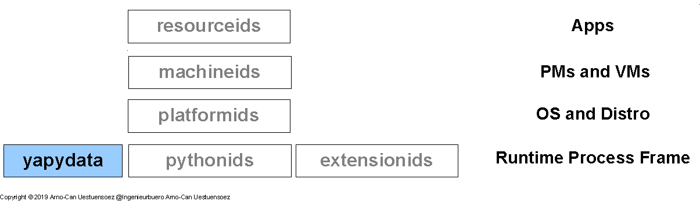

********
Abstract
********

Modern landscapes of information infrastructures are commonly designed 
and organized as stacks of runtime service environments.
The technical architecture of the service stacks consists of a wide range of
heterogenous landscapes of components frequently requiring adaptation and mediation.
This requires frequently low-level stack access to communications data as well as persistently 
stored advanced data formats such as *JSON*, *XML*, and *YAML*, but also *INI*,
and *.properties* files. 
The common mix of modern software landscapes with the integration of multiple apps in addition
requires frequently the access to mixed syntaxes and their combined processing. 

   
   Figure: Software Dependecy Layers |figuresystemabstractprint_zoom| :ref:`more... <REFERENCE_ARCHITECTURE>`

.. |figuresystemabstractprint_zoom| image:: _static/zoom.png
   :alt: zoom 
   :target: _static/systems-ids.png
   :width: 16

The *yapydata* - Yet Another Pythoin Data - package provides mixed heterogeneous syntaxes of data structures,
in-memory and/or from persistent sources. 
Therefore *yapydata* provides a collection of low-level modules supporting an abstract API decoupled from 
implementation details as well as syntactical differences.
These are allocated within the software stack at the bare-level of the *Python* framework.  
See following section :ref:`Blueprint <REFERENCE_ARCHITECTURE>` for more details.

The package '*YapyData*' is part of the set of packages of enumerations for efficient and fast operations of
code variants for software and infrastructure stacks. 
For other stack layers refer to [machineids]_, [platformids]_, [pythonids]_, [resourceids]_, and [extensionids]_.

Refer also to the virtual package [enumerateit]_ for the overall IT stack enumeration.
